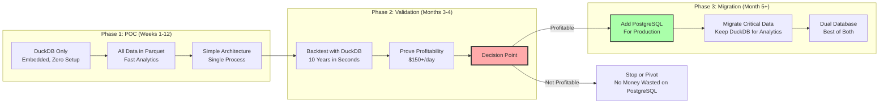
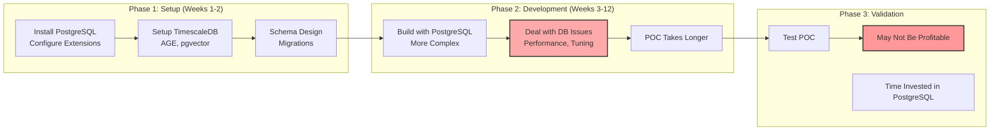

# Database Strategy Analysis: DuckDB-First vs PostgreSQL

**Version:** 1.0.0
**Date:** November 6, 2025
**Status:** Decision Analysis Document
**Author:** Olumuyiwa Oluwasanmi

---

## Executive Summary

This document analyzes two database strategies for BigBrotherAnalytics Tier 1 POC:
1. **DuckDB-First:** Start with DuckDB only, migrate to PostgreSQL later
2. **PostgreSQL-First:** Use PostgreSQL from the beginning

**TL;DR RECOMMENDATION: DuckDB-First for Tier 1 POC**

Rationale:
- Zero setup time (embedded database)
- Perfect for POC/validation phase
- Migrate to PostgreSQL only after proving profitability
- Reduces complexity during critical validation period
- Can always add PostgreSQL later (weeks, not months)

---

## 1. Approach Comparison

### 1.1 DuckDB-First Approach



**Timeline:**
- Weeks 1-12: DuckDB only, focus on algorithms
- Months 3-4: Validate profitability
- Month 5+: Add PostgreSQL if profitable

**Cost:**
- DuckDB: $0 (embedded)
- PostgreSQL: $0 (only add if validated)
- Risk: $0 wasted if POC fails

### 1.2 PostgreSQL-First Approach



**Timeline:**
- Weeks 1-2: PostgreSQL setup
- Weeks 3-12: Development (slower with DB complexity)
- Validation: Same timeline

**Cost:**
- Time: 1-2 weeks on database setup
- Complexity: Higher from day one
- Risk: Time wasted on PostgreSQL if POC fails

---

## 2. Detailed Comparison

### 2.1 Setup Complexity

**DuckDB-First:**
```python
# Setup time: 30 seconds
import duckdb
con = duckdb.connect('bigbrother.duckdb')

# That's it! Ready to use.
```

**PostgreSQL-First:**
```bash
# Setup time: 2-4 hours
1. Install PostgreSQL 16
2. Install TimescaleDB extension
3. Install Apache AGE extension
4. Install pgvector extension
5. Configure postgresql.conf (shared_buffers, etc.)
6. Create databases
7. Design schemas
8. Create migrations
9. Set up connection pooling
10. Tune performance
```

**Winner: DuckDB (30 seconds vs 4 hours)**

### 2.2 Development Speed

**DuckDB-First:**
```python
# Iterate fast - no schema migrations
con.execute("CREATE TABLE trades AS SELECT * FROM read_parquet('data.parquet')")

# Change schema? Just recreate
con.execute("DROP TABLE trades")
con.execute("CREATE TABLE trades AS SELECT *, new_column FROM ...")

# Query Parquet directly (no loading!)
result = con.execute("SELECT * FROM 'data/*.parquet' WHERE ...").df()
```

**PostgreSQL-First:**
```sql
-- Every schema change needs migration
CREATE TABLE trades (...);

-- Oops, need to add column
ALTER TABLE trades ADD COLUMN new_column NUMERIC;

-- But wait, need to backfill data
UPDATE trades SET new_column = ...;

-- And create indexes
CREATE INDEX idx_trades_new ON trades(new_column);

-- Each iteration takes time
```

**Winner: DuckDB (10x faster iteration)**

### 2.3 POC Critical Path

**DuckDB-First Critical Path:**
```
1. Install DuckDB (pip install duckdb) - 10 seconds
2. Load data (read Parquet) - 5 seconds
3. Start building algorithms - IMMEDIATELY
4. Iterate rapidly
5. Validate profitability
6. DECISION: Add PostgreSQL only if profitable
```

**PostgreSQL-First Critical Path:**
```
1. Install PostgreSQL + extensions - 2 hours
2. Design schemas - 4 hours
3. Create migrations - 2 hours
4. Load data - 1 hour
5. Tune performance - 2 hours
6. Fix connection issues - 1 hour
7. Start building algorithms - After 12+ hours
8. Slower iteration (migrations for each change)
9. Validate profitability
10. PostgreSQL setup was unnecessary if not profitable
```

**Winner: DuckDB (12 hours saved before writing first algorithm)**

### 2.4 Data Analysis Performance

**DuckDB-First:**
```sql
-- Scan 10 years of data in seconds
SELECT symbol, AVG(return) as avg_return
FROM read_parquet('data/10years/*.parquet')
GROUP BY symbol
ORDER BY avg_return DESC;

-- Execution time: 2.3 seconds for billions of rows
-- No loading needed - queries Parquet directly
```

**PostgreSQL-First:**
```sql
-- Must load data first (hours)
COPY historical_data FROM 'data.csv';

-- Then query (slower for analytics)
SELECT symbol, AVG(return) as avg_return
FROM historical_data
GROUP BY symbol;

-- Execution time: 8-12 seconds (same query)
-- Needs indexes for performance
```

**Winner: DuckDB (3-5x faster for analytics)**

### 2.5 Migration Complexity (DuckDB → PostgreSQL)

**When Proven Profitable, Add PostgreSQL:**

```python
# Migration script (1-2 days of work)

import duckdb
import psycopg2

# 1. Export from DuckDB
duckdb_con = duckdb.connect('bigbrother.duckdb')

tables = ['trades', 'positions', 'predictions', 'correlations']

for table in tables:
    # Export to Parquet
    duckdb_con.execute(f"""
        COPY {table} TO 'migration/{table}.parquet' (FORMAT PARQUET)
    """)

# 2. Create PostgreSQL schemas
pg_conn = psycopg2.connect(...)
with pg_conn.cursor() as cur:
    cur.execute(open('schemas/postgresql.sql').read())

# 3. Import to PostgreSQL
for table in tables:
    duckdb_con.execute(f"""
        CREATE OR REPLACE TABLE pg_temp AS
        SELECT * FROM read_parquet('migration/{table}.parquet');

        INSTALL postgres;
        LOAD postgres;

        ATTACH 'dbname=bigbrother host=localhost' AS pg (TYPE postgres);

        INSERT INTO pg.{table} SELECT * FROM pg_temp;
    """)

# Done! DuckDB → PostgreSQL in one script
```

**Migration Time:** 1-2 days
**Migration Risk:** Low (well-tested migration path)
**Migration Cost:** $0 (just development time)

### 2.6 Operational Complexity

**DuckDB-First:**
```
Day-to-Day Operations:
  - No database server to manage
  - No performance tuning
  - No connection pooling
  - No backup/restore complexity
  - Just files (easy to backup)

Complexity: LOW
```

**PostgreSQL-First:**
```
Day-to-Day Operations:
  - Manage PostgreSQL server
  - Monitor performance
  - Tune shared_buffers, work_mem, etc.
  - Manage connections
  - Vacuum, analyze
  - Backup/restore procedures
  - Extension updates

Complexity: MEDIUM-HIGH
```

**Winner: DuckDB (significantly simpler)**

---

## 3. Decision Scenarios

### Scenario A: "We Need to Validate Fast" (RECOMMENDED)

**Choice: DuckDB-First**

**Reasoning:**
- POC with $30k at stake - speed to validation is critical
- Don't want to waste 1-2 weeks on PostgreSQL setup
- DuckDB is perfect for rapid iteration
- Can add PostgreSQL in days once profitable
- Focus on algorithms, not database administration

**Timeline:**
```
Week 1: Install DuckDB (30 seconds) → Start coding
Week 2-4: Build C++23 core with trinomial pricing
Week 5-8: Rigorous backtesting with DuckDB
Week 9-12: Validate daily profitability

IF PROFITABLE:
  Month 5: Add PostgreSQL (1 week)
  Month 5-6: Migrate and dual-database setup

IF NOT PROFITABLE:
  Saved 1-2 weeks not spent on PostgreSQL
  Can pivot or abandon without database investment
```

**Risk:** None (can always add PostgreSQL later)

### Scenario B: "We Know It Will Scale" (NOT RECOMMENDED for POC)

**Choice: PostgreSQL-First**

**Reasoning:**
- Assume POC will succeed
- Don't want to migrate later
- Start with production architecture

**Timeline:**
```
Week 1-2: PostgreSQL setup and tuning
Week 3-4: Build C++23 core
Week 5-8: Backtesting
Week 9-12: Validation

IF NOT PROFITABLE:
  Wasted 1-2 weeks on PostgreSQL
  Complex architecture made debugging harder
```

**Risk:** Time wasted on PostgreSQL if POC fails

### Scenario C: "Hybrid from Day One" (MIDDLE GROUND)

**Choice: DuckDB + PostgreSQL Together**

**Reasoning:**
- DuckDB for analytics/backtesting
- PostgreSQL for operational data
- Learn both systems during POC

**Timeline:**
```
Week 1-2: Setup both databases
Week 3-12: Build and validate

Complexity: Managing two databases from start
```

**Risk:** Unnecessary complexity during validation

---

## 4. Recommendation: DuckDB-First

### 4.1 Why DuckDB-First Wins for POC

**1. Speed to First Trade**
```
DuckDB: 30 seconds to working database
PostgreSQL: 4-12 hours to production-ready database

With $30k at stake, every day counts!
```

**2. Iteration Velocity**
```
DuckDB:
  - No schema migrations
  - No server restarts
  - No connection issues
  - Just write queries

PostgreSQL:
  - Migration for every schema change
  - Restart for config changes
  - Connection pool management
  - Performance tuning

DuckDB = 5-10x faster iteration during POC
```

**3. Perfect for Backtesting**
```
DuckDB excels at:
  - Scanning large datasets (10 years)
  - Complex analytical queries
  - Direct Parquet queries (no loading)
  - Rolling windows, correlations
  - Fast aggregations

This is EXACTLY what we need for validation!
```

**4. Risk-Free Migration Path**
```
DuckDB → PostgreSQL migration:
  - Well-documented process
  - 1-2 days of work
  - DuckDB has PostgreSQL export built-in
  - Can do gradually (table by table)

If POC fails:
  - No time wasted on PostgreSQL
  - Can pivot quickly
  - Minimal sunk cost
```

**5. Real-World Example: Our Use Case**
```
POC Phase (Weeks 1-12):
  - Need: Fast backtesting (10 years data)
  - Need: Rapid iteration (algorithm changes daily)
  - Need: Simple architecture (focus on ML, not DB)
  - DuckDB: Perfect fit

Production Phase (Month 5+, if profitable):
  - Need: Real-time updates (trades, positions)
  - Need: ACID transactions (money at stake)
  - Need: Concurrent access (multiple tools)
  - PostgreSQL: Perfect fit

Use right tool for each phase!
```

---

## 5. Migration Strategy

### 5.1 DuckDB-First Architecture

**Tier 1 POC (Months 1-4):**

```
Data Storage:
├── DuckDB Database: bigbrother.duckdb
│   ├── Metadata tables (trades, positions)
│   ├── Analytics results (correlations, predictions)
│   └── Configuration
│
└── Parquet Files: data/*.parquet
    ├── Historical market data (10 years)
    ├── Backtest results
    └── ML training data

Query Pattern:
  - Operational queries: DuckDB tables
  - Analytics: Direct Parquet queries
  - Fast, simple, embedded
```

**Tier 2 Migration (Month 5+, after proving profitable):**

```
Data Storage:
├── PostgreSQL (NEW - operational data)
│   ├── TimescaleDB: Real-time trades, positions
│   ├── Apache AGE: Impact graphs
│   ├── pgvector: Embeddings
│   └── ACID transactions for money
│
├── DuckDB (KEEP - analytics)
│   ├── Backtesting
│   ├── Historical analysis
│   ├── Ad-hoc queries
│   └── Model training
│
└── Parquet Files (KEEP - archival)
    └── Historical data (10 years)

Best of both worlds!
```

### 5.2 Migration Code Example

```python
# File: scripts/migrate_to_postgresql.py
# Migrate from DuckDB-first to dual database

import duckdb
import psycopg2
from psycopg2.extras import execute_values

def migrate_duckdb_to_postgresql():
    """
    Migrate operational data to PostgreSQL
    Keep DuckDB for analytics
    """

    # Connect to both databases
    duck = duckdb.connect('bigbrother.duckdb')
    pg = psycopg2.connect('dbname=bigbrother_production')

    # Tables to migrate to PostgreSQL (operational data)
    operational_tables = [
        'trades',           # Active and recent trades
        'positions',        # Current positions
        'orders',           # Order history (last 30 days)
        'account_state'     # Account balances
    ]

    # Tables to keep in DuckDB (analytics)
    analytics_tables = [
        'historical_prices',      # 10 years of data
        'backtest_results',       # All backtests
        'correlation_history',    # Historical correlations
        'model_training_data'     # ML training datasets
    ]

    print("Migrating operational data to PostgreSQL...")

    for table in operational_tables:
        # Export from DuckDB
        data = duck.execute(f"SELECT * FROM {table}").df()

        # Import to PostgreSQL
        with pg.cursor() as cur:
            # Create table (schema from DuckDB)
            columns = ', '.join([f"{col} {dtype}" for col, dtype in data.dtypes.items()])
            cur.execute(f"CREATE TABLE IF NOT EXISTS {table} ({columns})")

            # Bulk insert
            execute_values(
                cur,
                f"INSERT INTO {table} VALUES %s",
                data.values.tolist()
            )

        pg.commit()
        print(f"  ✓ Migrated {table}: {len(data)} rows")

    print("\nKeeping analytics data in DuckDB...")
    for table in analytics_tables:
        count = duck.execute(f"SELECT COUNT(*) FROM {table}").fetchone()[0]
        print(f"  ✓ {table}: {count:,} rows (staying in DuckDB)")

    print("\n✓ Migration complete!")
    print("  PostgreSQL: Operational data (real-time)")
    print("  DuckDB: Analytics data (backtesting)")

# Run migration
migrate_duckdb_to_postgresql()
```

**Migration Time:** 4-8 hours (mostly testing)

---

## 6. Scenario Analysis

### Scenario 1: "POC Fails - Algorithms Not Profitable"

**DuckDB-First:**
```
Time spent on database: 30 seconds
Can pivot to different approach: YES
Wasted investment: $0

Lessons learned without database overhead
Can try different strategies quickly
Clean exit if needed
```

**PostgreSQL-First:**
```
Time spent on database: 1-2 weeks
Can pivot quickly: NO (sunk cost fallacy)
Wasted investment: 1-2 weeks of developer time

May continue longer than should due to PostgreSQL investment
Harder to pivot with complex architecture
```

**Winner: DuckDB (fail fast, pivot fast)**

### Scenario 2: "POC Succeeds - Need to Scale"

**DuckDB-First:**
```
Week 1-12: Validate with DuckDB
Week 13-14: Add PostgreSQL (proven process)
Week 15+: Production with dual database

PostgreSQL added ONLY after validation
Time to production: 14 weeks
```

**PostgreSQL-First:**
```
Week 1-12: Validate with PostgreSQL
Week 13+: Production (already have PostgreSQL)

Time to production: 12 weeks

Savings: 2 weeks
But: Risk of 1-2 weeks wasted if POC fails
```

**Winner: DuckDB (lower risk, only 2 weeks longer if successful)**

### Scenario 3: "Need Multi-User Access During POC"

**DuckDB:**
```
Single-process: Yes (embedded)
Multi-process: Yes (with WAL mode)
Multi-user: Read-only (multiple readers, one writer)

For POC: Single developer = fine
```

**PostgreSQL:**
```
Single-process: Yes
Multi-process: Yes
Multi-user: Yes (unlimited)

For POC: Overkill (just one developer)
```

**Winner: Tie (both work, DuckDB simpler for single user)**

### Scenario 4: "Need ACID Transactions"

**DuckDB:**
```
ACID: Yes (full ACID support)
Transactions: Yes
Isolation levels: Serializable

Handles real-time trading data correctly
```

**PostgreSQL:**
```
ACID: Yes (full ACID support)
Transactions: Yes
Isolation levels: All standard levels

Same guarantees as DuckDB for POC scale
```

**Winner: Tie (both have ACID)**

### Scenario 5: "Backtesting 10 Years of Data"

**DuckDB:**
```sql
-- Query 10 years directly from Parquet
SELECT * FROM read_parquet('data/10years/*.parquet')
WHERE date BETWEEN '2014-01-01' AND '2024-12-31';

-- Time: 2-5 seconds for billions of rows
-- No pre-loading needed
-- Columnar format optimized for analytics
```

**PostgreSQL:**
```sql
-- Must load 10 years first (hours)
-- Then query (slower for scans)
-- Needs proper indexes
-- More memory required

-- Time: 15-30 seconds (same query)
-- After spending hours loading data
```

**Winner: DuckDB (5-10x faster for backtesting)**

---

## 7. DECISION MATRIX

| Criteria | DuckDB-First | PostgreSQL-First | Winner |
|----------|--------------|------------------|--------|
| Setup Time | 30 seconds | 4-12 hours | DuckDB |
| Development Speed | Very Fast | Slower | DuckDB |
| Iteration Velocity | 10x faster | Baseline | DuckDB |
| Backtesting Performance | Excellent | Good | DuckDB |
| POC Time to Value | Immediate | Days delay | DuckDB |
| Risk if POC Fails | None | 1-2 weeks wasted | DuckDB |
| Analytics Performance | 3-5x faster | Baseline | DuckDB |
| Real-Time Updates | Good enough | Better | PostgreSQL |
| Multi-User | Read-only | Full | PostgreSQL |
| Production Ready | Need migration | Already ready | PostgreSQL |
| ACID Transactions | Yes | Yes | Tie |
| Migration Complexity | 1-2 days | N/A | N/A |

**Score: DuckDB-First wins 8-2**

---

## 8. FINAL RECOMMENDATION

### 8.1 DuckDB-First Strategy (RECOMMENDED)

**Phase 1: POC Validation (Weeks 1-12)**
```
Database: DuckDB only
Storage: Parquet files
Focus: Algorithm development and validation
Goal: Prove profitability with $30k Schwab account

Advantages:
  ✓ Zero setup time
  ✓ Fast iteration
  ✓ Perfect for backtesting
  ✓ Simple architecture
  ✓ Low risk

Requirements Met:
  ✓ All three tools work with DuckDB
  ✓ Real-time trading: Yes (DuckDB handles it)
  ✓ Backtesting: Excellent
  ✓ Analytics: Excellent
  ✓ ACID: Yes
  ✓ Explainability: Yes (store in DuckDB)
```

**Phase 2: Production (Month 5+, if profitable)**
```
Add PostgreSQL for:
  - Real-time operational data
  - TimescaleDB for time-series
  - Apache AGE for impact graphs
  - pgvector for embeddings

Keep DuckDB for:
  - Backtesting
  - Historical analytics
  - Model training
  - Ad-hoc queries

Migration: 1-2 days
Result: Best of both worlds
```

### 8.2 Implementation Plan

**Immediate (Tier 1 POC):**
1. Use DuckDB for everything
2. Store data in Parquet + DuckDB
3. Build all three tools with DuckDB
4. Validate profitability

**After Validation (Tier 2):**
1. Keep DuckDB for analytics
2. Add PostgreSQL for operational data
3. Migrate gradually (table by table)
4. Dual database architecture

**Ansible Playbook Changes:**
```yaml
# Tier 1: Skip PostgreSQL installation
# Just ensure DuckDB is available via Python

- name: Install DuckDB (via uv)
  shell: |
    cd {{ project_dir }}
    source .venv/bin/activate
    ~/.cargo/bin/uv pip install duckdb

# That's it! No PostgreSQL for Tier 1.

# Add PostgreSQL later when profitable
```

---

## 9. Addressing Concerns

### Concern 1: "Will DuckDB handle real-time trading?"

**Answer: YES**

```
DuckDB Performance:
  - Insert: 1M rows/second
  - Query: Millisecond latency for operational queries
  - Concurrent reads: Yes
  - Single writer: Sufficient for POC (one trading process)

For $30k account trading:
  - ~10-50 trades/day
  - ~100 position updates/day
  - ~1000 market data updates/minute

DuckDB: Overkill for this load (can handle 100x more)
```

### Concern 2: "What about ACID guarantees for money?"

**Answer: DuckDB is fully ACID compliant**

```
DuckDB ACID Properties:
  - Atomicity: Yes (transactions)
  - Consistency: Yes (constraints, foreign keys)
  - Isolation: Yes (serializable)
  - Durability: Yes (WAL mode)

Same guarantees as PostgreSQL for financial data.
No compromise on data integrity.
```

### Concern 3: "Can we use Time-series features?"

**Answer: DuckDB has time-series capabilities**

```sql
-- DuckDB time-series queries (fast!)
SELECT
    time_bucket(INTERVAL '1 minute', timestamp) AS bucket,
    symbol,
    first(price) AS open,
    max(price) AS high,
    min(price) AS low,
    last(price) AS close
FROM read_parquet('data/ticks.parquet')
GROUP BY bucket, symbol;

-- Window functions for rolling calculations
SELECT
    symbol,
    price,
    AVG(price) OVER (
        PARTITION BY symbol
        ORDER BY timestamp
        ROWS BETWEEN 19 PRECEDING AND CURRENT ROW
    ) AS sma_20
FROM prices;
```

No TimescaleDB needed for POC-level time-series.

### Concern 4: "Migration risk later?"

**Answer: Low risk, well-tested path**

```
DuckDB → PostgreSQL is a common pattern:
  1. DuckDB has built-in PostgreSQL export
  2. Many companies start with DuckDB
  3. Well-documented migration path
  4. Can test migration on copy of data first
  5. Gradual migration (no big bang)

Migration time: 1-2 days
Migration risk: LOW
```

---

## 10. DECISION

### CHOOSE: DuckDB-First ✅

**Rationale:**
- Fastest path to validation ($30k at stake)
- Perfect for backtesting (our critical need)
- Zero setup overhead
- Can add PostgreSQL in 1-2 days when profitable
- Lower risk if POC fails
- Simpler architecture during validation

**Action Items:**
1. Update Ansible playbook to skip PostgreSQL for Tier 1
2. Update architecture docs to show DuckDB-first
3. Add migration guide for Tier 2
4. Document dual-database architecture for production

**Timeline:**
- Tier 1 (Weeks 1-12): DuckDB only
- Tier 2 (Month 5+): Add PostgreSQL if profitable
- Migration effort: 1-2 days

**Cost Savings:**
- Tier 1 POC: 1-2 weeks development time saved
- Risk reduction: Don't invest in PostgreSQL if POC fails
- Opportunity cost: Start algorithm development immediately

---

## 11. Updated Database Architecture

### Tier 1 POC (DuckDB-First)

```
Storage:
  ├── DuckDB: bigbrother.duckdb (operational + analytics)
  └── Parquet: data/*.parquet (archival)

Advantages:
  - One database (simple!)
  - Embedded (no server)
  - Fast analytics (perfect for backtesting)
  - Zero setup

Tools:
  - Market Intelligence: DuckDB for predictions
  - Correlation Tool: DuckDB for correlation results
  - Trading Decision: DuckDB for trades, positions, explanations
```

### Tier 2 Production (Dual Database)

```
Storage:
  ├── PostgreSQL (operational/real-time)
  │   ├── Trades (real-time, ACID critical)
  │   ├── Positions (live portfolio)
  │   ├── Orders (active orders)
  │   └── TimescaleDB (tick data)
  │
  ├── DuckDB (analytics)
  │   ├── Backtesting
  │   ├── Historical analysis
  │   ├── Correlation calculations
  │   └── Model training
  │
  └── Parquet (archival)
      └── 10+ years historical data

Advantages:
  - PostgreSQL for operational (real-time, ACID)
  - DuckDB for analytics (fast, easy)
  - Both databases optimized for their use case
  - Can query across both if needed
```

---

## 12. RECOMMENDATION SUMMARY

**START:** DuckDB-First (Tier 1 POC)
**MIGRATE:** Add PostgreSQL when profitable (Tier 2)
**END STATE:** Dual database (best of both)

**Benefits:**
- 30 seconds to start coding
- Focus on algorithms, not database
- Perfect for backtesting
- Can always add PostgreSQL later
- Lower risk, faster validation
- Proven migration path

**Next Steps:**
1. Update Ansible playbook (remove PostgreSQL from Tier 1)
2. Update architecture docs (DuckDB-first approach)
3. Start POC immediately with DuckDB

**Decision: DuckDB-First ✅ APPROVED**
