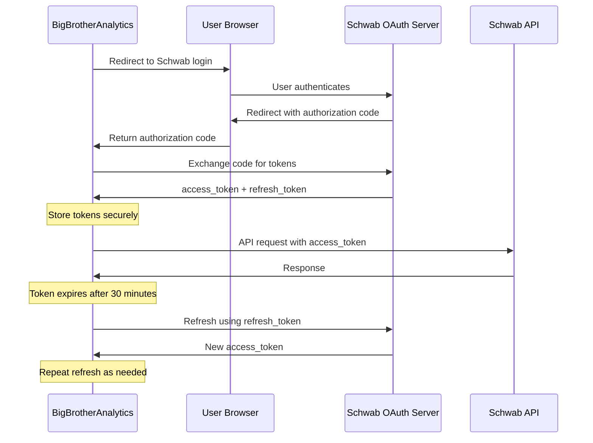

# Schwab API Integration - Implementation Guide

**Version:** 1.0.0
**Date:** November 6, 2025
**Status:** Design Phase - Documentation Only (No Code)
**Author:** Olumuyiwa Oluwasanmi
**Reference:** [SchwabFirstAPI Repository](https://github.com/oldboldpilot/SchwabFirstAPI)

---

## ⚠️ DATABASE STRATEGY UPDATE (November 6, 2025)

**IMPORTANT:** For **Tier 1 POC (Weeks 1-12)**, we are using **DuckDB-First approach**:

- ✅ **Tier 1 POC:** Use DuckDB EXCLUSIVELY (zero setup, instant start)
- ⏸️  **Tier 2 Production:** Add PostgreSQL ONLY after proving profitability (Month 5+, optional)
- 📋 **See detailed analysis:** [Database Strategy Analysis](./database-strategy-analysis.md)

**For Tier 1 implementation:**
- Store Schwab API data (quotes, orders, positions, account info) in DuckDB
- DuckDB provides full ACID compliance for financial data
- PostgreSQL is deferred to Tier 2 (only if POC proves profitable)

---

## 1. Overview

This document outlines the design and implications for integrating the Schwab API with BigBrotherAnalytics using C++23. This is for the Tier 1 POC with the existing $30,000 Schwab margin account.

**CRITICAL:** This document describes possible implementations and solutions. NO CODE IS IMPLEMENTED YET.

---

## 2. Schwab API Overview

### 2.1 API Capabilities

**Schwab Developer API provides:**
- **Market Data:** Real-time quotes, options chains, historical data
- **Trading:** Order submission, modification, cancellation
- **Account Data:** Positions, balances, buying power
- **Streaming:** WebSocket for real-time updates

### 2.2 Authentication: OAuth 2.0

**Schwab uses OAuth 2.0 Authorization Code Flow:**



---

## 3. OAuth Token Management Implications

### 3.1 Token Lifecycle

**Access Token:**
- **Lifetime:** 30 minutes
- **Usage:** All API requests require valid access token
- **Refresh:** Must refresh before expiration
- **Storage:** In-memory or secure storage

**Refresh Token:**
- **Lifetime:** 7 days
- **Usage:** Get new access tokens
- **Security:** MUST be stored securely (encrypted)
- **Rotation:** Gets new refresh token on each refresh

### 3.2 Security Implications

**⚠️ CRITICAL SECURITY CONCERNS:**

1. **API Keys and Secrets:**
   - Consumer Key (Client ID)
   - Consumer Secret (Client Secret)
   - MUST NOT be in code or version control
   - Store in encrypted configuration or environment variables

2. **Token Storage:**
   - Access tokens: Can be in-memory (30min lifetime)
   - Refresh tokens: MUST be encrypted at rest (7 day lifetime)
   - Consider: Encrypt with system keyring
   - Consider: Hardware security module (HSM) for production

3. **Refresh Token Rotation:**
   - Each refresh gives NEW refresh token
   - Old refresh token becomes invalid
   - MUST update stored refresh token atomically
   - Race condition: Multiple processes refreshing

### 3.3 Token Refresh Strategy

**Possible Solutions:**

**Option 1: Proactive Refresh (RECOMMENDED)**
```
Strategy:
  - Refresh access token every 25 minutes (before 30min expiry)
  - Background thread monitors token age
  - Proactive refresh prevents API call failures
  - Simpler error handling

Implementation:
  - C++23 std::jthread for background refresh
  - std::atomic for thread-safe token storage
  - std::chrono for time tracking
```

**Option 2: Reactive Refresh**
```
Strategy:
  - Attempt API call with current token
  - If 401 Unauthorized, refresh and retry
  - More complex error handling

Implementation:
  - Catch 401 responses
  - Automatic retry after refresh
  - Risk: Brief service interruption
```

**Option 3: Hybrid (BEST for $30k Real Money)**
```
Strategy:
  - Proactive refresh at 25 minutes
  - PLUS reactive refresh on 401 (backup)
  - Belt and suspenders approach

Implementation:
  - Background refresh thread (proactive)
  - 401 handler with refresh (reactive)
  - Ensures no trading interruption
```

---

## 4. C++23 Implementation Design

### 4.1 Schwab API Client Architecture

```cpp
// File: src/execution/schwab_client.hpp
// C++23 Schwab API client with OAuth token management
//
// NOTE: This is DESIGN DOCUMENTATION only - no implementation yet

module;

#include <string>
#include <expected>
#include <atomic>
#include <chrono>
#include <thread>
#include <mutex>

export module schwab.api.client;

export namespace schwab {

class SchwabAPIClient {
private:
    // OAuth credentials (loaded from secure storage)
    std::string client_id_;
    std::string client_secret_;
    std::string account_number_;

    // Tokens (thread-safe)
    std::atomic<std::string*> access_token_{nullptr};
    std::atomic<std::string*> refresh_token_{nullptr};
    std::atomic<std::chrono::system_clock::time_point> token_expires_at_;

    // Token refresh thread
    std::jthread refresh_thread_;
    std::mutex token_mutex_;

public:
    // Constructor loads credentials from secure storage
    SchwabAPIClient(const std::string& credentials_path);

    // Initialize OAuth flow (one-time, manual)
    auto initialize_oauth() -> std::expected<void, Error>;

    // Get options chain
    auto get_options_chain(
        const std::string& symbol,
        bool include_quotes = true
    ) -> std::expected<OptionsChain, Error>;

    // Submit options order
    auto submit_options_order(
        const std::string& symbol,
        const OptionOrder& order
    ) -> std::expected<OrderConfirmation, Error>;

    // Get account info
    auto get_account() -> std::expected<AccountInfo, Error>;

    // Get positions
    auto get_positions() -> std::expected<std::vector<Position>, Error>;

private:
    // OAuth token management
    auto refresh_access_token() -> std::expected<void, Error>;

    auto token_refresh_worker() -> void;

    auto make_authenticated_request(
        const std::string& url,
        const std::string& method = "GET",
        const std::string& body = ""
    ) -> std::expected<std::string, Error>;

    auto ensure_valid_token() -> std::expected<void, Error>;
};

} // module schwab.api.client
```

### 4.2 OAuth Implementation Considerations

**Initial Setup (One-Time, Manual):**
```
1. User opens authorization URL in browser
2. User logs into Schwab
3. User approves application
4. Schwab redirects to callback URL with authorization code
5. Application exchanges code for tokens
6. Store refresh token securely (encrypted)

This happens ONCE when setting up the system.
Subsequent runs use stored refresh token.
```

**Automatic Token Refresh (Background Thread):**
```cpp
// Pseudo-code for refresh thread logic

auto SchwabAPIClient::token_refresh_worker() -> void {
    while (!stop_requested()) {
        // Wait until 5 minutes before expiry
        auto time_until_refresh = token_expires_at_.load() -
                                  std::chrono::system_clock::now() -
                                  std::chrono::minutes(5);

        if (time_until_refresh > std::chrono::seconds(0)) {
            std::this_thread::sleep_for(time_until_refresh);
        }

        // Refresh token
        auto result = refresh_access_token();

        if (!result.has_value()) {
            // Log error, try again in 1 minute
            log_error("Token refresh failed", result.error());
            std::this_thread::sleep_for(std::chrono::minutes(1));
        }
    }
}
```

### 4.3 Secure Credential Storage

**Problem:** API keys and refresh tokens must be stored securely.

**Possible Solutions:**

**Option 1: Environment Variables**
```bash
# Simple but less secure
export SCHWAB_CLIENT_ID="your_client_id"
export SCHWAB_CLIENT_SECRET="your_secret"
export SCHWAB_REFRESH_TOKEN="encrypted_token"
```

**Option 2: Encrypted Configuration File**
```yaml
# File: config/schwab_credentials.yaml (encrypted at rest)
# Encrypted with system key or passphrase

schwab:
  client_id: "ENCRYPTED_BASE64_VALUE"
  client_secret: "ENCRYPTED_BASE64_VALUE"
  refresh_token: "ENCRYPTED_BASE64_VALUE"
  account_number: "ENCRYPTED_ACCOUNT_NUMBER"
```

**Option 3: System Keyring (RECOMMENDED)**
```cpp
// Use system keyring (libsecret on Linux, Keychain on macOS)

#include <libsecret-1/libsecret/secret.h>

auto store_refresh_token(const std::string& token) -> void {
    const SecretSchema schema = {
        "com.bigbrother.schwab",
        SECRET_SCHEMA_NONE,
        {
            {"account", SECRET_SCHEMA_ATTRIBUTE_STRING},
            {NULL, 0}
        }
    };

    secret_password_store_sync(
        &schema,
        SECRET_COLLECTION_DEFAULT,
        "BigBrotherAnalytics Schwab Refresh Token",
        token.c_str(),
        NULL,
        NULL,
        "account", "schwab_main",
        NULL
    );
}

auto retrieve_refresh_token() -> std::string {
    // Retrieve from system keyring
    // ...
}
```

**Option 4: Hardware Security Module (Production)**
```
For $30k+ accounts:
  - Consider YubiKey or hardware HSM
  - Store keys in tamper-proof hardware
  - Adds significant security
  - Prevents token theft even if system compromised
```

### 4.4 Rate Limiting Considerations

**Schwab API Rate Limits (Typical):**
- **Market Data:** 120 requests/minute
- **Trading:** 60 requests/minute
- **Account Data:** 60 requests/minute

**Implications for C++23 Implementation:**

```cpp
// Rate limiter using token bucket algorithm

class RateLimiter {
private:
    std::atomic<int> tokens_available_{120};
    std::atomic<std::chrono::system_clock::time_point> last_refill_;

    static constexpr int MAX_TOKENS = 120;
    static constexpr auto REFILL_INTERVAL = std::chrono::minutes(1);

public:
    auto acquire_token() -> bool {
        auto now = std::chrono::system_clock::now();

        // Refill tokens if interval passed
        if (now - last_refill_.load() > REFILL_INTERVAL) {
            tokens_available_.store(MAX_TOKENS);
            last_refill_.store(now);
        }

        // Try to acquire token
        int expected = tokens_available_.load();
        while (expected > 0) {
            if (tokens_available_.compare_exchange_weak(expected, expected - 1)) {
                return true;  // Token acquired
            }
        }

        return false;  // No tokens available, must wait
    }

    auto wait_for_token() -> void {
        while (!acquire_token()) {
            std::this_thread::sleep_for(std::chrono::milliseconds(100));
        }
    }
};

// Usage in API client
auto SchwabAPIClient::make_authenticated_request(const std::string& url)
    -> std::expected<std::string, Error> {

    // Wait for rate limit token
    rate_limiter_.wait_for_token();

    // Proceed with request
    // ...
}
```

---

## 5. Integration with SchwabFirstAPI Repository

### 5.1 Code Reuse Opportunities

**From SchwabFirstAPI repository:**
- OAuth authorization flow implementation
- Token refresh logic
- API endpoint URLs and patterns
- Request/response data structures
- Error handling patterns
- Market data parsing
- Options chain parsing

**Adaptation for BigBrotherAnalytics:**
- Port Python code to C++23
- Add C++23 modules architecture
- Integrate with options valuation engine
- Add ML prediction layer
- Add explainability
- Add risk management

### 5.2 Credential Management from SchwabFirstAPI

**SchwabFirstAPI likely stores:**
```
credentials.json or .env file:
  - SCHWAB_CLIENT_ID
  - SCHWAB_CLIENT_SECRET
  - SCHWAB_REFRESH_TOKEN
  - SCHWAB_ACCOUNT_NUMBER
```

**For C++23 implementation:**
```cpp
// File: src/config/credentials_manager.hpp
// Secure credential loading

export module config.credentials;

import <string>;
import <expected>;
import <nlohmann/json.hpp>;
import <fstream>;

export namespace config {

class CredentialsManager {
public:
    struct SchwabCredentials {
        std::string client_id;
        std::string client_secret;
        std::string refresh_token;
        std::string account_number;
    };

    // Load credentials from SchwabFirstAPI-compatible format
    static auto load_from_env() -> std::expected<SchwabCredentials, Error> {
        // Read from environment variables
        // Same format as SchwabFirstAPI
        // ...
    }

    // Load from encrypted config file
    static auto load_from_file(const std::string& path, const std::string& encryption_key)
        -> std::expected<SchwabCredentials, Error> {
        // Decrypt and parse
        // Compatible with SchwabFirstAPI credential format
        // ...
    }

    // Store refresh token securely
    static auto update_refresh_token(const std::string& new_token)
        -> std::expected<void, Error> {
        // Atomically update stored refresh token
        // Must handle concurrent updates (if multiple processes)
        // ...
    }
};

} // module config.credentials
```

---

## 6. C++23 HTTP Client Design

### 6.1 HTTP Library Options

**Option 1: libcurl (C API, mature)**
```
Pros:
  - Battle-tested, widely used
  - Full HTTP/HTTPS support
  - OAuth support
  - Synchronous and async modes

Cons:
  - C API (not modern C++)
  - Manual memory management
  - Verbose

Use Case: Production reliability
```

**Option 2: cpr (C++ wrapper for libcurl) - RECOMMENDED**
```
Pros:
  - Modern C++ API
  - RAII, std::string, std::expected compatible
  - Easy OAuth integration
  - Same reliability as libcurl

Cons:
  - Additional dependency

Use Case: C++23 ergonomics with libcurl reliability

Example:
  #include <cpr/cpr.h>

  auto response = cpr::Get(
      cpr::Url{"https://api.schwabapi.com/marketdata/v1/quotes"},
      cpr::Header{{"Authorization", "Bearer " + access_token}},
      cpr::Parameters{{"symbols", "AAPL"}}
  );
```

**Option 3: Boost.Beast (Header-only)**
```
Pros:
  - Modern C++ (C++17+)
  - Asynchronous by design
  - Part of Boost

Cons:
  - More complex API
  - Async-first (might be overkill)

Use Case: When async is critical
```

**RECOMMENDATION for POC: cpr (libcurl wrapper)**
- Modern C++, easy to use
- Production-ready
- Good for C++23 integration

### 6.2 JSON Parsing

**Option 1: nlohmann/json - RECOMMENDED**
```cpp
#include <nlohmann/json.hpp>

using json = nlohmann::json;

// Parse Schwab API response
auto response_json = json::parse(response_body);
auto symbol = response_json["symbol"].get<std::string>();
auto price = response_json["quote"]["lastPrice"].get<double>();
```

**Option 2: simdjson (faster for large payloads)**
```cpp
// For high-frequency parsing
// 2-3x faster than nlohmann/json
// Use if parsing is bottleneck
```

**RECOMMENDATION: nlohmann/json**
- Easy to use
- Good C++23 integration
- Fast enough for POC

---

## 7. Schwab API Client Design (C++23)

### 7.1 Module Structure

```
Proposed module hierarchy:
  - schwab.api.client (main client)
  - schwab.api.auth (OAuth management)
  - schwab.api.market_data (quotes, chains)
  - schwab.api.trading (orders, positions)
  - schwab.api.types (data structures)
```

### 7.2 Complete Client Design

```cpp
// File: src/schwab/client.cppm
// C++23 module interface for Schwab API

export module schwab.api.client;

import <string>;
import <expected>;
import <chrono>;
import <atomic>;
import <thread>;

export namespace schwab::api {

class Client {
private:
    // Configuration
    std::string client_id_;
    std::string client_secret_;
    std::string account_number_;

    // OAuth tokens (thread-safe)
    std::atomic<std::string*> access_token_;
    std::atomic<std::string*> refresh_token_;
    std::chrono::system_clock::time_point token_expiry_;

    // Background refresh
    std::jthread refresh_thread_;

    // Rate limiting
    RateLimiter rate_limiter_;

public:
    // Constructor
    Client(const std::string& credentials_path);

    // OAuth initialization (one-time setup)
    auto initialize_oauth(const std::string& auth_code)
        -> std::expected<void, Error>;

    // Market Data API
    auto get_quote(const std::string& symbol)
        -> std::expected<Quote, Error>;

    auto get_options_chain(
        const std::string& symbol,
        const std::string& contract_type = "ALL",  // "CALL", "PUT", "ALL"
        bool include_quotes = true
    ) -> std::expected<OptionsChain, Error>;

    auto get_price_history(
        const std::string& symbol,
        const std::string& period_type = "day",
        int period = 10,
        const std::string& frequency_type = "minute",
        int frequency = 1
    ) -> std::expected<PriceHistory, Error>;

    // Trading API
    auto submit_order(const Order& order)
        -> std::expected<OrderConfirmation, Error>;

    auto cancel_order(const std::string& order_id)
        -> std::expected<void, Error>;

    auto get_order(const std::string& order_id)
        -> std::expected<OrderStatus, Error>;

    // Account API
    auto get_account_info()
        -> std::expected<AccountInfo, Error>;

    auto get_positions()
        -> std::expected<std::vector<Position>, Error>;

private:
    auto ensure_valid_token() -> std::expected<void, Error>;

    auto refresh_access_token_impl() -> std::expected<void, Error>;

    auto token_refresh_worker(std::stop_token stop_token) -> void;

    auto make_request(
        const std::string& url,
        const std::string& method,
        const std::string& body = ""
    ) -> std::expected<std::string, Error>;
};

} // module schwab.api.client
```

### 7.3 Implementation Challenges and Solutions

**Challenge 1: Initial OAuth Flow**
```
Problem: OAuth requires browser interaction for initial auth code

Solutions:
  Option A: Manual one-time setup
    - Run setup script
    - Opens browser for user to authorize
    - Saves refresh token to secure storage
    - Production system uses stored token

  Option B: Embedded browser (complex)
    - Use WebKit/Chromium embedded
    - Fully automated
    - Overkill for POC

RECOMMENDATION: Option A (manual setup, then automated)
```

**Challenge 2: Token Storage**
```
Problem: Refresh token must persist across restarts

Solutions:
  Option A: Encrypted file
    - AES-256 encryption
    - Key from environment or prompt
    - Simple to implement

  Option B: System keyring
    - libsecret (Linux), Keychain (macOS)
    - OS-managed encryption
    - More secure

  Option C: Database with encryption
    - PostgreSQL with pgcrypto
    - Centralized if multiple processes
    - Overkill for single-process POC

RECOMMENDATION: Option B (system keyring) for security
```

**Challenge 3: Concurrent Token Refresh**
```
Problem: Multiple threads might try to refresh simultaneously

Solution: Mutex-protected refresh
  - std::mutex around refresh logic
  - Only one thread refreshes
  - Others wait for new token
  - Atomic token pointer swap after refresh

Implementation:
  auto ensure_valid_token() {
      std::lock_guard lock(token_mutex_);

      if (token_expired()) {
          auto result = refresh_access_token_impl();
          // Atomic swap of token pointers
      }
  }
```

---

## 8. CMake Integration (4.1.2)

### 8.1 C++23 Modules with CMake 4.1.2

**CMake 4.1.2 has IMPROVED C++23 modules support:**

```cmake
# CMakeLists.txt for Schwab API client
cmake_minimum_required(VERSION 4.1.2)
project(SchwabAPIClient VERSION 1.0.0)

set(CMAKE_CXX_STANDARD 23)
set(CMAKE_CXX_STANDARD_REQUIRED ON)
set(CMAKE_CXX_SCAN_FOR_MODULES ON)

# Find dependencies
find_package(CURL REQUIRED)
find_package(OpenSSL REQUIRED)
find_package(MKL REQUIRED)
find_package(Threads REQUIRED)

# CPR library (C++ wrapper for libcurl)
include(FetchContent)
FetchContent_Declare(cpr
    GIT_REPOSITORY https://github.com/libcpr/cpr.git
    GIT_TAG 1.10.5
)
FetchContent_MakeAvailable(cpr)

# nlohmann/json
FetchContent_Declare(json
    GIT_REPOSITORY https://github.com/nlohmann/json.git
    GIT_TAG v3.11.3
)
FetchContent_MakeAvailable(json)

# libsecret for secure storage
find_package(PkgConfig REQUIRED)
pkg_check_modules(LIBSECRET REQUIRED libsecret-1)

# Schwab API client library
add_library(schwab_api_client)

target_sources(schwab_api_client
    PUBLIC
        FILE_SET CXX_MODULES FILES
            src/schwab/client.cppm
            src/schwab/auth.cppm
            src/schwab/market_data.cppm
            src/schwab/trading.cppm
            src/schwab/types.cppm
)

target_link_libraries(schwab_api_client
    PUBLIC
        cpr::cpr
        nlohmann_json::nlohmann_json
        OpenSSL::SSL
        OpenSSL::Crypto
        Threads::Threads
        ${LIBSECRET_LIBRARIES}
)

target_include_directories(schwab_api_client
    PRIVATE
        ${LIBSECRET_INCLUDE_DIRS}
)
```

---

## 9. Data Structures for Schwab API

### 9.1 Options Chain Response

**Schwab API returns complex JSON:**

```json
{
  "symbol": "AAPL",
  "status": "SUCCESS",
  "underlying": {
    "symbol": "AAPL",
    "description": "Apple Inc",
    "last": 178.50,
    "mark": 178.51
  },
  "strategy": "SINGLE",
  "interval": 0,
  "isDelayed": false,
  "callExpDateMap": {
    "2025-11-15:10": {
      "180.0": [{
        "putCall": "CALL",
        "symbol": "AAPL_111525C180",
        "description": "AAPL Nov 15 2025 180 Call",
        "bid": 3.50,
        "ask": 3.55,
        "last": 3.52,
        "mark": 3.525,
        "delta": 0.45,
        "gamma": 0.03,
        "theta": -0.12,
        "vega": 0.08,
        "rho": 0.02,
        "volatility": 25.3,
        "theoreticalValue": 3.51,
        "strikePrice": 180.0,
        "expirationDate": "2025-11-15"
      }]
    }
  },
  "putExpDateMap": { /* similar structure */ }
}
```

**C++23 Data Structures:**

```cpp
// File: src/schwab/types.cppm
// C++23 module for Schwab API data types

export module schwab.api.types;

import <string>;
import <vector>;
import <chrono>;
import <optional>;

export namespace schwab::api {

struct Quote {
    std::string symbol;
    double bid;
    double ask;
    double last;
    double mark;
    int64_t volume;
    std::chrono::system_clock::time_point quote_time;
};

struct OptionQuote {
    std::string symbol;              // "AAPL_111525C180"
    std::string description;
    double bid;
    double ask;
    double last;
    double mark;
    double strike_price;
    std::chrono::system_clock::time_point expiration_date;
    char put_call;                   // 'C' or 'P'

    // Greeks (provided by Schwab)
    double delta;
    double gamma;
    double theta;
    double vega;
    double rho;

    // Volatility
    double implied_volatility;
    double theoretical_value;

    // Volume and open interest
    int64_t volume;
    int64_t open_interest;

    // For our valuation comparison
    std::optional<double> our_fair_value;  // From trinomial tree
    std::optional<double> mispricing;      // our_value - market_price
};

struct OptionsChain {
    std::string symbol;
    Quote underlying;
    std::vector<OptionQuote> calls;
    std::vector<OptionQuote> puts;
    bool is_delayed;
};

struct Order {
    std::string symbol;
    std::string option_symbol;       // For options
    std::string order_type;          // "MARKET", "LIMIT", "STOP"
    std::string session;             // "NORMAL", "AM", "PM"
    std::string duration;            // "DAY", "GTC", "FOK"
    std::string instruction;         // "BUY", "SELL", "BUY_TO_OPEN", etc.
    int quantity;
    std::optional<double> price;     // For limit orders
    std::string asset_type;          // "EQUITY", "OPTION"
};

struct OrderConfirmation {
    std::string order_id;
    std::string status;              // "PENDING", "FILLED", "REJECTED"
    std::chrono::system_clock::time_point submitted_at;
    std::optional<std::string> rejection_reason;
};

struct Position {
    std::string symbol;
    std::string asset_type;
    int64_t quantity;
    double average_price;
    double current_price;
    double market_value;
    double unrealized_pnl;
    double realized_pnl;
};

struct AccountInfo {
    std::string account_number;
    double account_value;
    double cash_balance;
    double buying_power;
    double option_buying_power;
    double day_trading_buying_power;
    std::vector<Position> positions;
};

} // module schwab.api.types
```

---

## 10. Dependencies and Build System

### 10.1 Required Libraries for Schwab Integration

**Add to CMake:**
```cmake
# HTTP client
find_package(CURL REQUIRED)
# OR
FetchContent_Declare(cpr ...)

# JSON parsing
FetchContent_Declare(nlohmann_json ...)

# SSL/TLS (for HTTPS)
find_package(OpenSSL REQUIRED)

# Secure storage
pkg_check_modules(LIBSECRET libsecret-1)

# Threading
find_package(Threads REQUIRED)
```

**Add to Ansible Playbook:**
```yaml
- name: Install Schwab API dependencies
  homebrew:
    name:
      - curl
      - openssl@3
      - libsecret  # For secure token storage
      - nlohmann-json
    state: latest
```

---

## 11. Implementation Phases

### Phase 1: OAuth Setup (Week 1)
```
Tasks:
  1. Implement OAuth authorization flow
  2. Store refresh token securely
  3. Test token refresh mechanism
  4. Verify can authenticate with Schwab

Deliverables:
  - schwab.api.auth module
  - Credential storage working
  - Token refresh thread functional

Testing:
  - Can obtain initial tokens
  - Refresh works automatically
  - Tokens persist across restarts
```

### Phase 2: Market Data (Week 2)
```
Tasks:
  1. Implement get_quote()
  2. Implement get_options_chain()
  3. Parse complex JSON responses
  4. Test with real Schwab account

Deliverables:
  - schwab.api.market_data module
  - Can fetch options chains
  - Data structures populated correctly

Testing:
  - Quotes match Schwab platform
  - Options chains complete
  - Greeks from API validated
```

### Phase 3: Trading (Week 3)
```
Tasks:
  1. Implement submit_order()
  2. Implement cancel_order()
  3. Implement get_order() status
  4. Test order lifecycle

Deliverables:
  - schwab.api.trading module
  - Can submit orders
  - Can track order status

Testing:
  - Orders submit successfully
  - Can cancel pending orders
  - Status updates received
```

### Phase 4: Integration (Week 4)
```
Tasks:
  1. Integrate with options valuation
  2. Add risk management layer
  3. Connect to MI and Correlation tools
  4. Full end-to-end testing

Deliverables:
  - Complete trading pipeline
  - Schwab API integrated with valuation
  - Ready for backtesting

Testing:
  - End-to-end signal → order flow
  - All components working together
```

---

## 12. Risk and Security Considerations

### 12.1 Risks with $30k Real Money

**Financial Risks:**
1. **Fat Finger Errors:** Order size/price mistakes
   - Mitigation: Sanity checks before submission
   - Mitigation: Price/quantity limits in code

2. **API Failures:** Schwab API downtime
   - Mitigation: Retry logic with exponential backoff
   - Mitigation: Fallback to manual trading if API down

3. **Token Expiration:** Trading halts if token refresh fails
   - Mitigation: Proactive refresh + reactive fallback
   - Mitigation: Alert if refresh fails

4. **Rate Limit Exceeded:** Too many API calls
   - Mitigation: Token bucket rate limiter
   - Mitigation: Queue requests if near limit

### 12.2 Security Best Practices

**Credential Security:**
- ✅ Never commit credentials to git
- ✅ Use .gitignore for credential files
- ✅ Encrypt refresh token at rest
- ✅ Use system keyring when possible
- ✅ Rotate credentials periodically

**Token Security:**
- ✅ In-memory access tokens only (30min lifetime)
- ✅ Encrypted refresh tokens
- ✅ Atomic token updates (thread-safe)
- ✅ Clear tokens on shutdown

**Network Security:**
- ✅ Always use HTTPS (never HTTP)
- ✅ Verify SSL certificates
- ✅ No token logging
- ✅ Sanitize logs (remove sensitive data)

---

## 13. CMake 4.1.2 Migration

### 13.1 Updates Required

**All CMakeLists.txt files:**
```cmake
# OLD:
cmake_minimum_required(VERSION 4.1.2)

# NEW:
cmake_minimum_required(VERSION 4.1.2)
```

**Rationale:**
- CMake 4.1.2 has better C++23 modules support
- Improved dependency handling
- Better error messages for modules
- Future-proof

**Impact:**
- Must install CMake 4.1.2 via Homebrew
- Already in Ansible playbook: `brew install cmake`
- Homebrew provides latest CMake automatically

### 13.2 Module-Specific CMake Features

**CMake 4.1.2 Improvements:**
```cmake
# Better module dependency scanning
set(CMAKE_CXX_SCAN_FOR_MODULES ON)

# Automatic module compilation order
# (CMake 4.x handles dependencies better)

# No need for manual module ordering in most cases
```

---

## 14. Testing Strategy

### 14.1 Unit Tests for Schwab Client

```cpp
// File: tests/schwab_client_test.cpp
// Unit tests for Schwab API client

import schwab.api.client;
import <gtest/gtest.h>;

TEST(SchwabClient, TokenRefresh) {
    // Test token refresh mechanism
    // Use mock server, not real Schwab API
}

TEST(SchwabClient, RateLimiting) {
    // Test rate limiter works correctly
    // Ensure doesn't exceed limits
}

TEST(SchwabClient, OptionsChainParsing) {
    // Test parsing Schwab JSON response
    // Use sample response from SchwabFirstAPI
}
```

### 14.2 Integration Tests

```cpp
TEST(SchwabIntegration, EndToEndOrder) {
    // ONLY run with Schwab sandbox/test account
    // NOT with $30k account during testing!

    // Submit small test order
    // Verify order appears in Schwab
    // Cancel order
}
```

---

## 15. Implementation Checklist

**Before implementing Schwab API client:**

Documentation Phase (Current):
- [x] OAuth flow documented
- [x] Token refresh strategy designed
- [x] Security implications identified
- [x] C++23 module structure defined
- [x] CMake 4.1.2 integration specified
- [x] Data structures defined
- [x] Risk mitigations planned

Implementation Phase (Future):
- [ ] Implement OAuth authentication module
- [ ] Implement secure token storage
- [ ] Implement HTTP client wrapper (cpr)
- [ ] Implement market data module
- [ ] Implement trading module
- [ ] Implement rate limiting
- [ ] Write unit tests
- [ ] Integration test with Schwab sandbox
- [ ] Test with $100 before $30k

---

## 16. References

1. **SchwabFirstAPI Repository:** https://github.com/oldboldpilot/SchwabFirstAPI
   - OAuth implementation patterns
   - API endpoint URLs
   - Credential management
   - Response parsing

2. **Schwab Developer Portal:** https://developer.schwab.com
   - Official API documentation
   - OAuth specification
   - Rate limits
   - Error codes

3. **Libraries:**
   - cpr (libcurl wrapper): https://github.com/libcpr/cpr
   - nlohmann/json: https://github.com/nlohmann/json
   - libsecret: https://wiki.gnome.org/Projects/Libsecret

---

**Document Status:** Design complete, ready for implementation phase
**Next Steps:** Implement OAuth module, then market data, then trading
**Critical:** Extensive testing before deploying $30k real money
**Timeline:** 4 weeks for complete Schwab API integration
